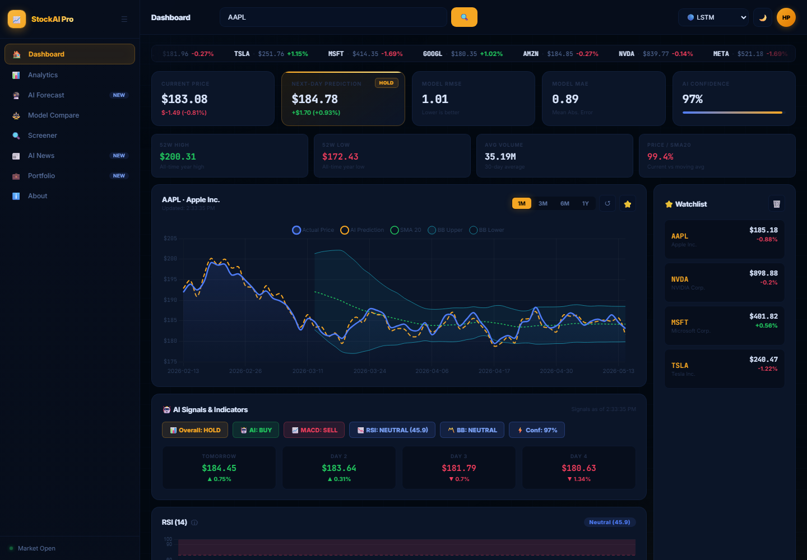
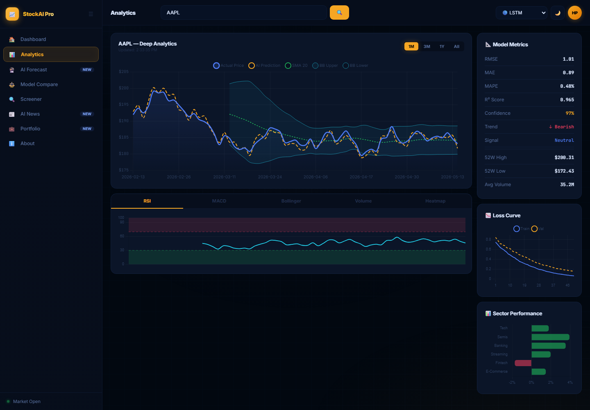
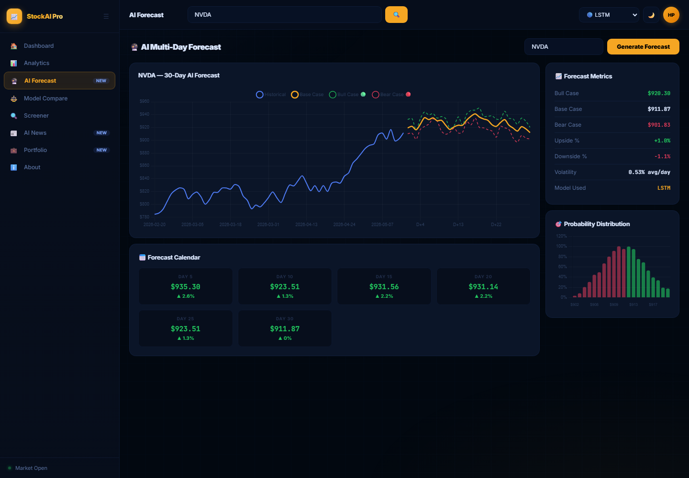
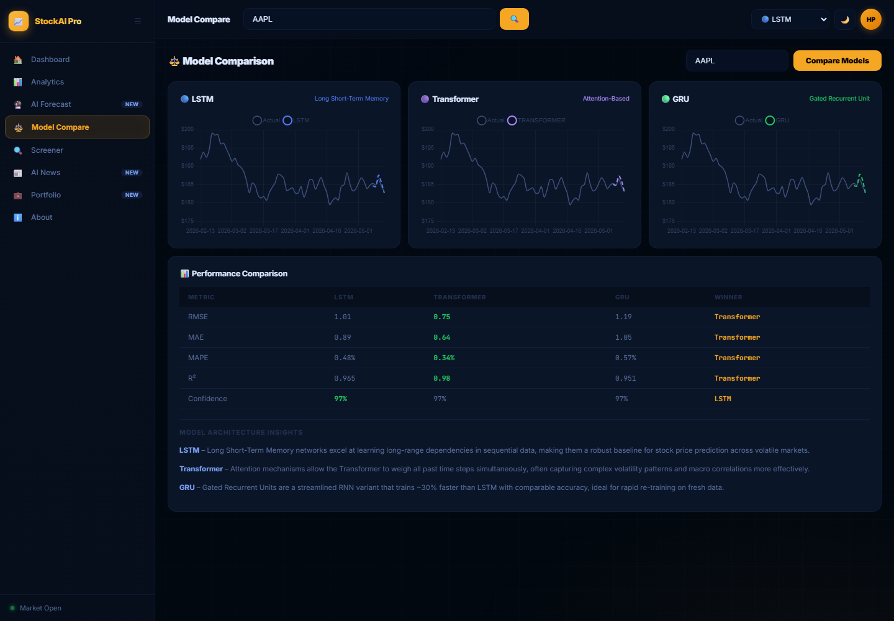
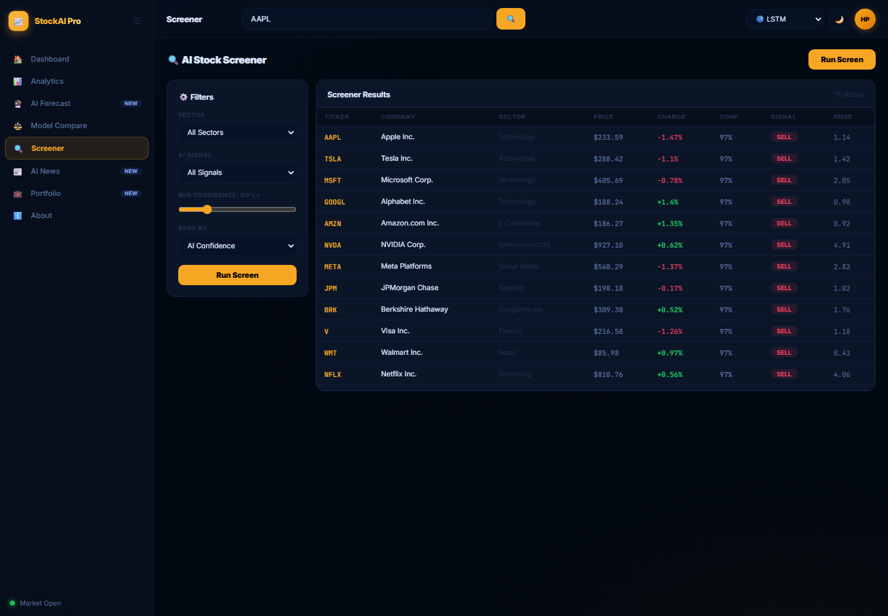
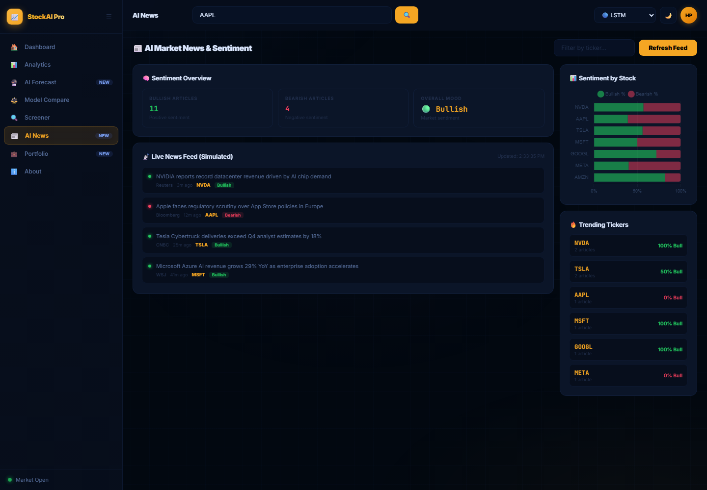
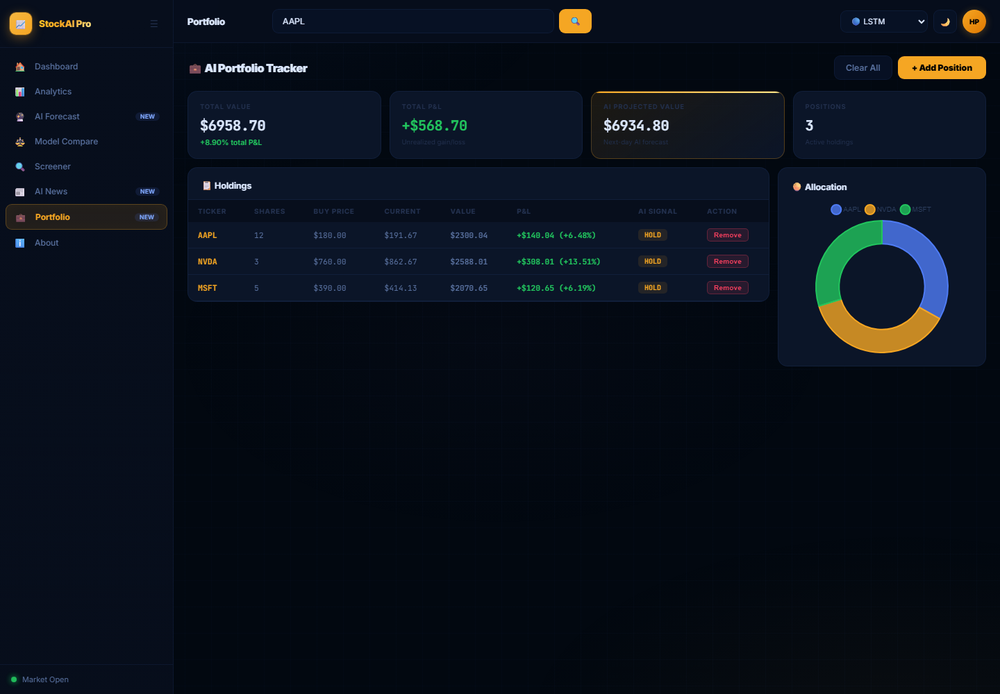
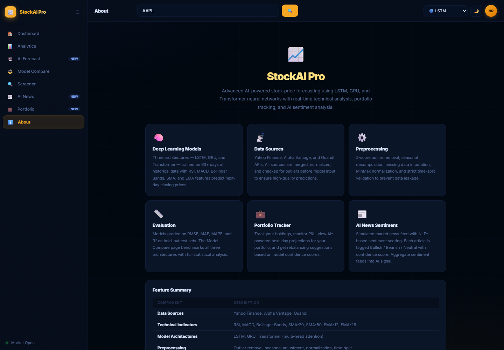
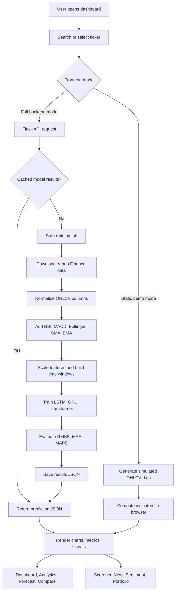

# Stock Predictor AI

Stock Predictor AI is a full-stack AI stock forecasting dashboard that combines technical analysis, deep learning models, model comparison, portfolio tracking, stock screening, and market sentiment views in one interactive web experience.

The project is built as a Flask API plus a responsive HTML/CSS/JavaScript dashboard. It can run as a static demo with simulated market data or as a full ML application using Yahoo Finance data and TensorFlow models.

## Live UI Preview

| Dashboard | Analytics |
|---|---|
|  |  |

| AI Forecast | Model Compare |
|---|---|
|  |  |

| Stock Screener | Market News Sentiment |
|---|---|
|  |  |

| Portfolio Tracker | About / Feature Summary |
|---|---|
|  |  |

## What It Does

- Forecasts stock prices with LSTM, GRU, and Transformer models.
- Fetches historical OHLCV data from Yahoo Finance through `yfinance`.
- Builds technical indicators including RSI, MACD, Bollinger Bands, SMA, EMA, volatility, and volume ratios.
- Serves prediction, training, indicator, status, and comparison endpoints through Flask.
- Displays a real dashboard with price charts, model metrics, AI signals, watchlist, forecast calendar, screener, sentiment feed, and portfolio allocation.
- Supports static demo mode for frontend previews and full backend mode for real model training.

## System Flow



## Core Features

| Area | Details |
|---|---|
| Dashboard | Current price, next-day forecast, confidence, RMSE, MAE, watchlist, ticker tape, AI signals |
| Analytics | Deep price chart, RSI, MACD, Bollinger Bands, volume, heatmap, loss curve, sector performance |
| Forecast | 30-day bull/base/bear forecast, probability distribution, forecast calendar |
| Model Compare | LSTM vs GRU vs Transformer charts and metric table |
| Screener | Filter stocks by sector, AI signal, confidence, price change, and model error |
| News Sentiment | Simulated market news feed with bullish/bearish sentiment summary |
| Portfolio | Holdings table, P&L, projected AI value, allocation chart |
| Backend | Flask REST API, background training, cached JSON model outputs |

## Tech Stack

- Frontend: HTML, CSS, JavaScript, Chart.js
- Backend: Flask, Flask-CORS, Gunicorn
- ML/Data: TensorFlow/Keras, NumPy, Pandas, scikit-learn, yfinance
- Models: LSTM, GRU, Transformer encoder
- Deployment: Docker and Render-ready configuration

## Project Structure

```text
Stock_Predictor/
  app.py                  Flask API and static file server
  model.py                Data pipeline, indicators, ML training, evaluation
  index.html              Main dashboard UI
  css/style.css           Responsive dashboard styling
  js/app.js               UI controller and app state
  js/charts.js            Chart.js rendering layer
  js/data.js              Static demo data and technical indicators
  assets/screenshots/     Real UI screenshots used in this README
  requirements.txt        Python dependencies
  Dockerfile              Container deployment
  render.yaml             Render deployment config
```

## Quick Start

### Static UI Demo

Open the dashboard directly:

```text
index.html?mock=true
```

For a pre-filled demo state:

```text
index.html?mock=true&demo=true&ticker=AAPL
```

### Full Stack Mode

Use Python 3.11 for best TensorFlow compatibility.

```bash
pip install -r requirements.txt
python app.py
```

Then open:

```text
http://localhost:5000
```

## Train Models

Train all supported models from the command line:

```bash
python model.py AAPL --models LSTM GRU Transformer
```

Train from the API:

```bash
curl -X POST http://localhost:5000/api/train/AAPL \
  -H "Content-Type: application/json" \
  -d '{"models": ["LSTM", "GRU", "Transformer"]}'
```

## API Reference

| Method | Endpoint | Purpose |
|---|---|---|
| `GET` | `/api/predict/<ticker>?model=LSTM` | Return latest predictions for one model |
| `POST` | `/api/train/<ticker>` | Start model training for a ticker |
| `GET` | `/api/status/<ticker>` | Check whether model output is ready |
| `GET` | `/api/compare/<ticker>` | Compare available trained models |
| `GET` | `/api/indicators/<ticker>` | Return latest technical indicator values |

Example:

```bash
curl "http://localhost:5000/api/predict/AAPL?model=LSTM"
```

## Deployment

### Docker

```bash
docker build -t stock-predictor-ai .
docker run -p 7860:7860 stock-predictor-ai
```

### Render

The repository includes `render.yaml`:

```text
Build command: pip install -r requirements.txt
Start command: gunicorn app:app --bind 0.0.0.0:$PORT
Python: 3.11.0
```

## Notes

- The static frontend can run with simulated data for demo and presentation purposes.
- Full backend mode trains models on Yahoo Finance data and saves outputs in `results/`.
- Model quality depends on data recency, volatility, feature design, and retraining frequency.
- This project is for education and research only. It is not financial advice.

## License

No license file is currently included. Add a license before public or commercial reuse.
